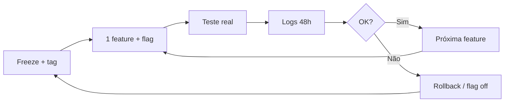

# Política oficial — Controlled Progressive Activation (CPA)

**Projeto:** Açucaradas Encomendas  
**Versão política:** 1.0  
**Data:** 2026-05-22  
**Status:** Ativa — evolução modular sem quebrar produção

---

## Missão

Evoluir o app de forma **contínua e enterprise**, preservando o que já foi validado em produção (Stripe Connect, Functions v7, iOS Safari, TestFlight), aplicando **uma ativação por vez**, com rollback imediato e evidência real.

> **Filosofia:** Freeze → pequena ativação → teste real → logs → validação → próxima ativação.

---

## O que já provou valor (não regredir)

| Domínio | Tag / referência | Estado |
|---------|------------------|--------|
| Stripe Connect + onboarding iOS | `stripe-connect-stable-v1` | Congelado |
| Firebase Functions v7 + Secret Manager | commit `1cc926b`+ | Estável |
| Safari + `return_url` HTTPS | `docs/STRIPE_CONNECT_FREEZE.md` | Congelado |
| Hosting Stripe pages (`web.app`) | deploy validado | Estável |
| Marketplace core | `stable-marketplace-v1` | Referência |

**Regra:** alterações em itens congelados exigem **novo tag** + teste completo + aprovação explícita.

---

## Os 10 princípios CPA

### 1️⃣ Freeze antes de mudar

Antes de qualquer feature nova:

1. Criar **tag Git** (`<domínio>-stable-vN`)
2. Documentar estado (audit ou release note)
3. Confirmar rollback: `git checkout <tag>`

Exemplos:

```bash
git tag stripe-connect-stable-v1    # existente
git tag finance-stable-v1           # criar ANTES da Semana 1 financeira
```

### 2️⃣ Uma feature por vez

| ✅ Correto | ❌ Proibido |
|-----------|-------------|
| 1 PR = 1 capacidade mensurável | Carteira + IA + analytics no mesmo sprint |
| 1 commit focal (ou squash reviewável) | Refactor massivo “de passagem” |
| Validar em iPhone antes da próxima | “Resolver tudo” numa release |

### 3️⃣ Feature flags obrigatórias

Toda capacidade nova entra **desligada** em produção até validação.

**Convenção (app):** `EXPO_PUBLIC_ENABLE_<DOMÍNIO>_<FEATURE>=false`

| Flag (proposta) | Default | Domínio |
|-----------------|---------|---------|
| `EXPO_PUBLIC_ENABLE_STRIPE_PAYMENTS` | `false` | Pagamentos (existente) |
| `EXPO_PUBLIC_ENABLE_FINANCIAL_REAL_DATA` | `false` | Dados financeiros reais vs mock |
| `EXPO_PUBLIC_ENABLE_STRIPE_ACCOUNT_PERSIST` | `false` | Persist `stripeAccountId` |
| `EXPO_PUBLIC_ENABLE_PRODUCER_PAYOUTS_UI` | `false` | UI repasses reais |
| `EXPO_PUBLIC_ENABLE_FINANCIAL_AI` | `false` | Card IA / estimativas |
| `EXPO_PUBLIC_ENABLE_STRIPE_REPORTS` | `false` | Reports Firestore (não mock) |

**Regra:** UI mock **não** pode aparecer com flag `true` sem backend correspondente (Regra Faria Lima).

### 4️⃣ Teste real obrigatório

Checklist mínimo por ativação:

- [ ] iPhone físico (build TestFlight ou dev client estável)
- [ ] Conta produtor real ou staging espelhado
- [ ] Stripe Dashboard (conta Connect, transfers, webhooks)
- [ ] Cloud Logging (Functions + filtro `[STRIPE_*]` / domínio da feature)
- [ ] Firestore: documento `users/{uid}` e `orders` afetados
- [ ] Safari / `openURL` se tocar onboarding

### 5️⃣ Observabilidade

Monitorar após cada ativação (48–72 h):

| Sinal | Onde |
|-------|------|
| Crashes | Sentry / TestFlight feedback |
| Onboarding Stripe | Logs app + Functions |
| Payouts / transfers | Stripe Dashboard + `orders.payoutStatus` |
| Firestore writes | Regras + logs `FS_PERMISSION_DENIED` |
| Functions errors | Cloud Logging |
| UX produtor | Sessão gravada / checklist manual |

### 6️⃣ Rollback imediato

Cada ativação = **1 commit revertível** (ou tag intermédia).

```bash
# Opção A — revert do commit da feature
git revert <sha> --no-edit

# Opção B — voltar ao freeze
git checkout finance-stable-v1

# Opção C — flag off sem redeploy (se só frontend)
EXPO_PUBLIC_ENABLE_<FEATURE>=false
```

**Critério de rollback:** crash em produção, regressão onboarding, payout incorreto, permissão Firestore em massa.

### 7️⃣ Stack congelada (não tocar sem crise)

Enquanto não houver **necessidade crítica** documentada:

- Stripe Connect freeze (`return_url`, Safari, Functions Stripe nomeadas)
- Secret Manager bindings
- Firebase Functions **runtime** / major SDK bump
- Hosting rewrites `/stripe-success`, `/stripe-refresh`
- Expo SDK / React Native major

Infra paralela (HostGator marketing, universal links) = **projetos separados**, tags separados.

### 8️⃣ MVP primeiro — operação real

**Prioridade:** o produtor **vê e confia** no que é verdadeiro.

**Não prioridade neste ciclo:** perfeição técnica, IA futurista, dashboard enterprise, automação massiva.

### 9️⃣ Regra Faria Lima

Se o utilizador pode interpretar como **dinheiro real**, o dado deve ser **real** ou a UI deve ser **transparente** (“em breve”, “indisponível”, remover card).

| Proibido em produção | Permitido |
|----------------------|-----------|
| `R$ 850,00` hardcoded | Soma real de `orders` ou ocultar card |
| Reports mock com flag on | Disclaimer + flag off |
| “Repasses automáticos” sem `stripeAccountId` | Status honesto + próximo passo |

Evidência: `docs/MVP_FINANCEIRO_PRODUTOR_AUDIT.md`.

### 🔟 Curva de evolução

```
MVP (dados mínimos reais)
  → confiança operacional
  → IA só com dados reais
  → automação
  → inteligência operacional
  → plataforma completa
```

---

## Fluxo operacional (CPA loop)



---

## Domínios e tags recomendados

| Domínio | Tag atual / próximo | Doc freeze / audit |
|---------|---------------------|-------------------|
| Stripe Connect | `stripe-connect-stable-v1` | `STRIPE_CONNECT_FREEZE.md` |
| Financeiro produtor | **`finance-stable-v1` (criar)** | `MVP_FINANCEIRO_PRODUTOR_AUDIT.md` |
| Hosting / domínio | — | `HOSTING_DOMAIN_AUDIT.md` |
| Marketing IA | — | `MARKETING_SITES_ARCHITECTURE.md` |
| Marketplace | `stable-marketplace-v1` | — |

---

## Roadmap financeiro (CPA — uma semana por ativação)

Detalhe: `docs/rollouts/FINANCE_ACTIVATION_ROADMAP.md`

| Semana | Única ativação | Flag sugerida | Fora do freeze Stripe? |
|--------|----------------|---------------|-------------------------|
| 0 | Tag `finance-stable-v1` + remover mock R$ 850 **ou** disclaimer | — | Não |
| 1 | Persistir `stripeAccountId` em `users/{uid}` | `ENABLE_STRIPE_ACCOUNT_PERSIST` | Sim (novo tag v2 Stripe*) |
| 2 | Sync on focus Conta Bancária | — | Não* |
| 3 | UI status real (sem card fake) | `ENABLE_FINANCIAL_REAL_DATA` | Não |
| 4 | Pedidos pagos / total repassado (Firestore) | `ENABLE_PRODUCER_PAYOUTS_UI` | Não |
| 5 | Próximo repasse / transfers list | `ENABLE_PRODUCER_PAYOUTS_UI` | Não |
| 6+ | Reports reais, IA com dados | `ENABLE_STRIPE_REPORTS`, `ENABLE_FINANCIAL_AI` | Não |

\* Semana 1 altera persistência — requer branch dedicada, testes, possível `stripe-connect-stable-v2` se tocar Function congelada; preferir **client write** com regras Firestore existentes para evitar mudar `createConnectedAccount`.

---

## Template de ativação (copiar por PR)

```markdown
## CPA Activation — <nome>

- **Tag base:** finance-stable-v1
- **Flag:** EXPO_PUBLIC_ENABLE_XXX=false → true (preview only)
- **Escopo único:** ...
- **Não altera:** return_url, Safari, createConnectedAccount (se aplicável)
- **Teste real:** iPhone / Stripe Dashboard / logs
- **Rollback:** git revert <sha> ou flag off
```

---

## Anti-padrões (rejeitar PR)

- Múltiplas flags ligadas no mesmo merge
- Refactor de pastas + feature nova
- Remover freeze sem tag successor
- Mock com flag `true`
- Dependência de DNS + app + Functions no mesmo deploy
- “Já que estamos aqui…” scope creep

---

## Governança

| Papel | Responsabilidade |
|-------|------------------|
| Produto | Prioriza 1 item do roadmap CPA |
| Engenharia | 1 PR, flag, logs, rollback path |
| QA / ops | Teste real iPhone + Stripe |
| Release | Não promover build com flags on sem checklist |

---

## Referências

- `docs/STRIPE_CONNECT_FREEZE.md`
- `docs/MVP_FINANCEIRO_PRODUTOR_AUDIT.md`
- `docs/rollouts/FINANCE_ACTIVATION_ROADMAP.md`
- `.agents/stripe.md`

---

**Assinatura:** esta política substitui abordagens “big bang”. Toda evolução financeira e de marketplace passa pelo loop CPA até novo comunicado.
