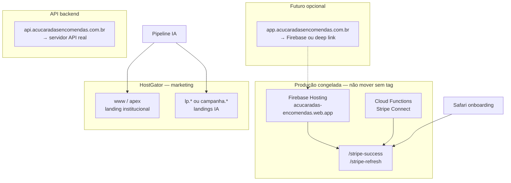
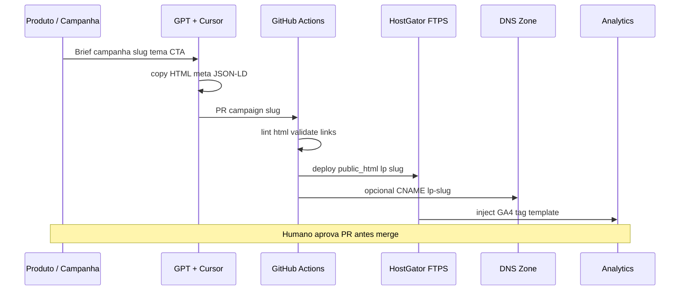

# Arquitetura — Marketing Sites Pipeline (IA + HostGator)

**Data:** 2026-05-22  
**Estado:** Auditoria + preparação — **sem implementação**  
**Isolamento:** não altera app RN, Stripe Connect freeze, Firebase produção nem DNS apex atual.

**Relacionado:** `docs/HOSTING_DOMAIN_AUDIT.md` · `docs/STRIPE_CONNECT_FREEZE.md`

---

## 1. Resumo executivo

O ecossistema atual tem **dois planos de hosting distintos**:

| Plano | Onde vive hoje | Função |
|-------|----------------|--------|
| **Produto / Stripe / app web** | Firebase (`acucaradas-encomendas.web.app`) | Onboarding Stripe, deploy CI conhecido |
| **Marketing / landing** | HostGator (`162.241.2.50`) | Site institucional no apex |

Automação futura de landings por IA deve correr num **repositório e pipeline separados**, publicando em **subdomínios HostGator** ou **Firebase sites secundários** — nunca no mesmo target que `stripe-success` / Functions.

---

## 2. PASSO 1 — Auditoria HostGator (estado conhecido + checklist)

### 2.1 Evidência técnica (DNS público, sem cPanel)

| Recurso | Valor |
|---------|--------|
| Apex `acucaradasencomendas.com.br` | A → `162.241.2.50` |
| `www` | CNAME → apex |
| `api.acucaradasencomendas.com.br` | A → `162.241.2.50` (mesmo IP — provável vhost/cPanel) |
| NS | `ns902` / `ns903.hostgator.com.br` |
| `app.acucaradasencomendas.com.br` | **Não resolvido** (subdomínio a criar) |

Conteúdo apex: landing marketing WordPress/HTML ("Inicio - Açucaradas Encomendas") — **não** é Firebase.

### 2.2 Checklist cPanel (validação manual — obrigatória)

Executar no painel HostGator com conta titular:

| Área | Verificar | Uso na automação |
|------|-----------|------------------|
| **cPanel login** | URL `https://…:2083` ou portal HostGator | Base para FTP e DNS Zone Editor |
| **FTP/SFTP** | Contas em *FTP Accounts*; FTPS porta 21/990 | Deploy GitHub Actions (`FTP-Deploy-Action`) |
| **SSH** | Disponível no plano? (muitos shared = não) | Preferir FTP se SSH off |
| **DNS Zone Editor** | Registos A/CNAME/TXT | Subdivisão `lp.*`, `www`, `app` |
| **SSL** | AutoSSL / Let's Encrypt por domínio | HTTPS landings |
| **Subdomínios** | *Subdomains* → `public_html/lp1` etc. | Uma pasta por campanha |
| **WordPress Toolkit** | Instalações WP no apex? | IA pode gerar HTML estático **ou** WP via REST (mais frágil) |
| **APIs HostGator** | **Sem API pública de deploy** no tier shared | Automação = FTP + DNS + opcional WP REST |
| **Limites** | inode, CPU, `max_execution_time` | Batch deploy pequenos sites estáticos |

**Nota:** HostGator (Newfold) não expõe MCP/API equivalente ao Hostinger MCP para shared hosting. Pipeline realista = **GitHub Actions → FTPS → `public_html/`**.

### 2.3 Credenciais para automação (futuro)

Guardar apenas em **GitHub Secrets** / Secret Manager (projeto separado):

```
HG_FTP_SERVER
HG_FTP_USER
HG_FTP_PASSWORD
HG_CPANEL_API_TOKEN   # só se UAPI disponível no plano
```

Nunca commitar no repo `AcucaradasEncomendas` (app principal).

---

## 3. PASSO 2 — Estratégia de domínios (separação)

### 3.1 Mapa alvo (recomendado)



| Subdomínio | Destino recomendado | Conteúdo | Toca Stripe? |
|------------|---------------------|----------|--------------|
| **apex** / **www** | HostGator (atual) | Marketing institucional, SEO, blog | Não |
| **app.** | Firebase Hosting (futuro) | Landing app download / universal links | Só leitura; não mudar return_url sem tag |
| **api.** | VPS/Cloud Run/Railway (não HostGator shared) | REST `api.acucaradasencomendas.com.br` | Webhooks Stripe no backend, não na landing |
| **lp.** / **campanha.** | HostGator `public_html/lp/{slug}/` | Landings geradas por IA | CTAs para lojas; sem Connect |
| **Firebase default** | `*.web.app` | Stripe pages + artefactos app | **Congelado** |

### 3.2 Regra de ouro DNS

- **Não mover apex** até pipeline marketing estar estável em `www` ou `lp.`.
- **Stripe `return_url`** permanece no domínio que apontar para **Firebase** — hoje funciona em `web.app`; correção DNS apex→Firebase é decisão **separada** do pipeline IA (ver `HOSTING_DOMAIN_AUDIT.md`).

### 3.3 Inconsistência no monorepo (registar)

| Referência no código | Domínio |
|----------------------|---------|
| `functions/index.js` return_url | `acucaradasencomendas.com.br` |
| Scripts `.env` | `api.acucaradas.com.br` |
| `security-headers.js` | `api.acucaradas.com` |

Padronizar **numa fase futura** de API — fora deste escopo.

---

## 4. PASSO 3 — Pipeline IA (ferramentas)

### 4.1 Papéis

| Ferramenta | Papel no pipeline |
|------------|-------------------|
| **GPT / Claude** | Copy, estrutura SEO, variantes A/B, metadados |
| **Cursor** | Gerar HTML/CSS/JS estático, componentes, revisão no repo marketing |
| **TRAE** (ou IDE IA alternativa) | Prototipagem rápida de landings; export para repo Git |
| **GitHub** | Repo `acucaradas-marketing-sites` (sugerido, separado) |
| **GitHub Actions** | Build + deploy FTPS HostGator; preview PR |
| **Firebase Hosting** | Opcional: site secundário `marketing-acucaradas` para previews; **não** site prod Stripe |
| **HostGator FTPS** | Produção marketing |

### 4.2 Repositórios (isolamento)

```
AcucaradasEncomendas/          ← app + Functions + Stripe (CONGELADO)
acucaradas-marketing-sites/    ← NOVO: landings, templates, workflows IA
```

Branch protegida no repo app; marketing com `main` + `campaign/{slug}`.

### 4.3 Stack técnica sugerida por landing

| Opção | Prós | Contras |
|-------|------|---------|
| **HTML estático** | FTPS simples, rápido, IA-friendly | Sem CMS |
| **Astro / 11ty** | SEO, partials, build pequeno | Passo build no CI |
| **WordPress (subpasta)** | Editor humano depois | IA + WP = mais manutenção |

**Recomendação v1:** HTML estático ou Astro → `dist/` → FTP.

---

## 5. PASSO 4 — Fluxo de automação (futuro)



### 5.1 Artefactos por campanha

```
campaigns/
  doces-natal-2026/
    brief.yaml          # tom, público, CTA
    index.html          # gerado IA + revisão humana
    assets/
    seo.json            # title, description, og:image
    analytics.json      # GA4 measurement id
```

### 5.2 Gates de qualidade (CI)

- HTML válido / links internos 200
- Sem secrets no HTML
- Lighthouse CI ≥ limiar acordado (opcional)
- `robots.txt` / `sitemap` atualizados por workflow
- **Proibido** referenciar `stripe-success` ou chaves Stripe na landing

### 5.3 Conexão Stripe (marketing apenas)

| Permitido | Proibido |
|-----------|----------|
| CTA "Baixar app" → App Store / Play | Embutir Connect onboarding |
| Link para site institucional | Alterar `return_url` |
| Menção "pagamentos seguros via Stripe" (copy) | Chaves secret/publishable em HTML |

Connect permanece no **app + Functions** congelados.

---

## 6. PASSO 5 — O que NÃO fazer agora

- [ ] Migrar domínio apex para Firebase  
- [ ] Alterar DNS produção sem runbook  
- [ ] Unificar repos app + marketing  
- [ ] Workflow FTP no repo `AcucaradasEncomendas`  
- [ ] Auto-publicar sem aprovação humana PR  
- [ ] Universal links / Associated Domains para campanhas  

---

## 7. Roadmap de implementação (fases)

| Fase | Entrega | Risco |
|------|---------|-------|
| **0** (atual) | Este documento + checklist cPanel | Nenhum |
| **1** | Repo marketing + template HTML + 1 landing manual FTP teste | Baixo |
| **2** | GitHub Action FTPS + secrets HostGator | Baixo |
| **3** | Prompt pack IA (Cursor rules / skill) + `brief.yaml` | Baixo |
| **4** | Subdomínio `lp.acucaradasencomendas.com.br` wildcard ou por campanha | Médio |
| **5** | Analytics + Search Console por campanha | Baixo |
| **6** | Opcional Firebase preview channel para QA antes FTP | Baixo |
| **7** | Decisão DNS apex vs Firebase (Stripe) — **projeto à parte** | Alto |

---

## 8. Integração com produção existente

```
┌─────────────────────────────────────────────────────────────┐
│  PRODUÇÃO CONGELADA (não tocar no pipeline marketing v1)   │
│  App iOS/Android · Functions v7 · stripe-connect-stable-v1 │
│  Firebase web.app + stripe-success/refresh                  │
└─────────────────────────────────────────────────────────────┘
                              │
                              │ apenas links de marketing
                              ▼
┌─────────────────────────────────────────────────────────────┐
│  MARKETING IA (novo)                                        │
│  HostGator www + lp.* · repo separado · GitHub Actions FTP  │
└─────────────────────────────────────────────────────────────┘
```

---

## 9. Checklist imediato (operacional)

1. [ ] Login cPanel HostGator — confirmar plano (shared/VPS) e SSH  
2. [ ] Criar FTP account `deploy-lp@acucaradasencomendas.com.br` só `public_html/lp/`  
3. [ ] Testar FTPS manual com FileZilla  
4. [ ] Documentar se apex é WordPress (Toolkit)  
5. [ ] Criar subdomínio teste `lp.acucaradasencomendas.com.br` → pasta vazia  
6. [ ] Criar repo GitHub `acucaradas-marketing-sites` (privado)  
7. [ ] Definir skill Cursor `marketing-landing-generator` (futuro)  
8. [ ] Manter Stripe freeze intacto  

---

## 10. Resultado esperado

Arquitetura **enterprise-ready** para:

- gerar landings com IA (copy + HTML),  
- publicar automaticamente via CI/CD FTPS,  
- integrar domínios por subdomínio sem colidir com app/Stripe/Firebase prod,  
- escalar campanhas com analytics e SEO,  

**sem** regressão no Stripe Connect nem no app principal.

---

## Referências externas

- [FTP-Deploy-Action](https://github.com/SamKirkland/FTP-Deploy-Action) — deploy GitHub → cPanel/HostGator  
- [HostGator WP plugin](https://github.com/newfold-labs/wp-plugin-hostgator) — integração painel (não substitui CI)  
- Firebase multi-site — só se previews marketing forem em projeto Firebase **secundário**
