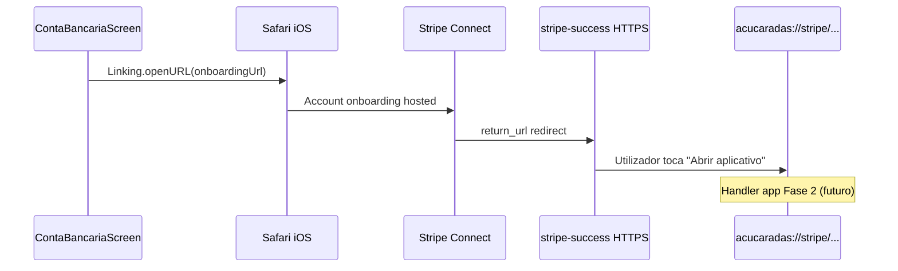

# Release interna — Stripe Connect Stable v1

| Campo | Valor |
|-------|--------|
| **Versão** | `stripe-connect-stable-v1` |
| **Commit** | `1cc926b` |
| **Branch** | `lab/stripe-isolation` |
| **Data** | 2026-05-22 |
| **Estado** | Congelado — produção / App Store Review safe |

**Documentação relacionada:** `docs/STRIPE_CONNECT_FREEZE.md` · **Backup:** `docs/stripe-freeze-v1/backup/`

---

## Resumo

Stack Stripe Connect Express validada em iPhone (Safari externo), Firebase Functions v7, Secret Manager, Firebase Hosting e landing `stripe-success` com CTA premium. Nenhuma alteração estrutural planejada nesta fase.

---

## Fluxo oficial (produção)



1. **App** — Conta Bancária → Configurar / Continuar cadastro  
2. **Functions** — `createConnectedAccount` → `createStripeOnboardingLink`  
3. **Safari** — onboarding Stripe (KYC / dados financeiros)  
4. **Web** — `https://acucaradasencomendas.com.br/stripe-success`  
5. **CTA** — `acucaradas://stripe/onboarding-complete` (toque explícito)  
6. **Sync** — manual: "Já prenchi, atualizar status" → `syncStripeAccountStatus`

**Sessão expirada:** `https://acucaradasencomendas.com.br/stripe-refresh`

---

## URLs e artefatos congelados

| Artefato | Valor / caminho |
|----------|-----------------|
| `return_url` | `https://acucaradasencomendas.com.br/stripe-success` |
| `refresh_url` | `https://acucaradasencomendas.com.br/stripe-refresh` |
| Deep link CTA | `acucaradas://stripe/onboarding-complete` |
| Hosting rewrites | `firebase.json` → `/stripe-success`, `/stripe-refresh` |
| Tag Git | `stripe-connect-stable-v1` |

---

## Screenshots (evidência de release)

> Adicionar capturas reais do iPhone após teste final e colocar em `docs/releases/screenshots/v1/`.

| # | Cena | Ficheiro sugerido |
|---|------|-------------------|
| 1 | Conta Bancária — antes do onboarding | `01-conta-bancaria.png` |
| 2 | Safari — formulário Stripe | `02-stripe-safari.png` |
| 3 | `stripe-success` — mensagem + botão | `03-stripe-success.png` |
| 4 | App após retorno manual (opcional) | `04-app-return.png` |

---

## Known limitations (v1)

| Limitação | Impacto | Fase futura |
|-----------|---------|-------------|
| Sem handler `Linking` para `onboarding-complete` | Botão pode abrir o app na raiz, não na Conta Bancária | Fase 2 |
| Sem auto-sync ao voltar do Safari | Utilizador usa "Atualizar status" manualmente | Fase 2b |
| Sem Universal Links | Sem retorno automático one-tap desde HTTPS | Fase 3 |
| `return_url` deve permanecer HTTPS | Não usar `acucaradas://` no Stripe Account Link | — |
| Validação remota automatizada | Ambiente CI/agent pode falhar TLS/404; validar no dispositivo | — |

**Não é regressão** se o app abrir mas não navegar para Conta Bancária — comportamento esperado até Fase 2.

---

## Checklist de validação produção

### Git (concluído)

- [x] Tag local: `stripe-connect-stable-v1`
- [x] Push branch: `lab/stripe-isolation`
- [x] Push tag: `stripe-connect-stable-v1`

### Hosting (validar no browser / iPhone)

- [ ] `https://acucaradasencomendas.com.br/stripe-success` → 200, HTML dedicado (não SPA genérica)
- [ ] `https://acucaradasencomendas.com.br/stripe-refresh` → 200, HTML dedicado
- [ ] Botão **Abrir aplicativo** visível
- [ ] Sem auto-redirect para deep link

### iPhone (teste final)

- [ ] Conta Bancária → Configurar Conta  
- [ ] Onboarding Stripe completo  
- [ ] Landing `stripe-success` com copy clara  
- [ ] Toque em **Abrir aplicativo**  
- [ ] Experiência profissional / Apple Review safe  

---

## Monitoramento operacional

| Métrica | Fonte |
|---------|--------|
| Erros `createConnectedAccount` | GCP Cloud Logging |
| Erros `createStripeOnboardingLink` | GCP Cloud Logging |
| Contas incompletas | Stripe Dashboard → Connect |
| Abandono pós-redirect | Hits `/stripe-success` (Firebase Hosting) |
| Erros Safari / openURL | Logs app `[STRIPE_*]` |
| Sync manual | Frequência do botão "Atualizar status" |

**Alertas sugeridos (opcional):** taxa de erro Functions Stripe > 5% em 15 min.

---

## Rollback

### Código

```bash
git checkout stripe-connect-stable-v1
```

### Config (sem Git)

Restaurar ficheiros de `docs/stripe-freeze-v1/backup/` e:

```bash
firebase deploy --only hosting   # só HTML
# Functions: janela de manutenção + deploy controlado
```

---

## Proibido nesta fase

- Universal links, auto-redirect, app association  
- `Linking.addEventListener` / handler automático  
- Auto-sync Firestore ao retorno  
- Alterar `return_url`, `refresh_url`, Functions Stripe, Safari flow  
- Rebuild iOS **apenas** por causa Stripe (sem Fase 2 aprovada)  

---

## Roadmap futuro (não iniciar sem novo tag)

| Fase | Entrega | Tag sugerido |
|------|---------|--------------|
| 2 | Handler `acucaradas://stripe/onboarding-complete` + navegação | `stripe-connect-stable-v2` |
| 2b | Auto-sync on focus / AppState na Conta Bancária | incluído em v2 |
| 3 | Universal Links + AASA + `associatedDomains` | `stripe-connect-stable-v3` |

---

## Assinatura de release

**Stripe Connect Stable v1** está oficialmente congelado para operação em produção. Alterações na lista "Proibido" exigem aprovação de produto + novo ciclo de teste iOS + Functions + Hosting.

— Equipa Açucaradas Encomendas · 2026-05-22
